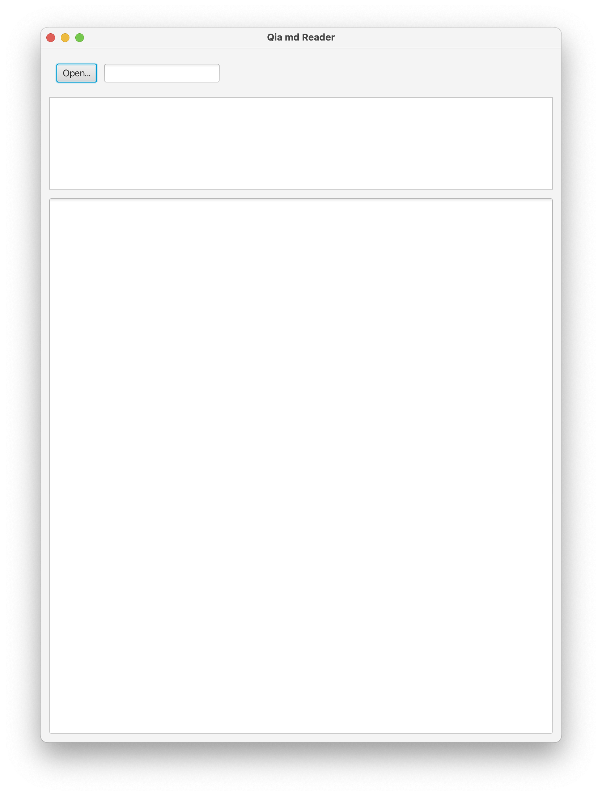
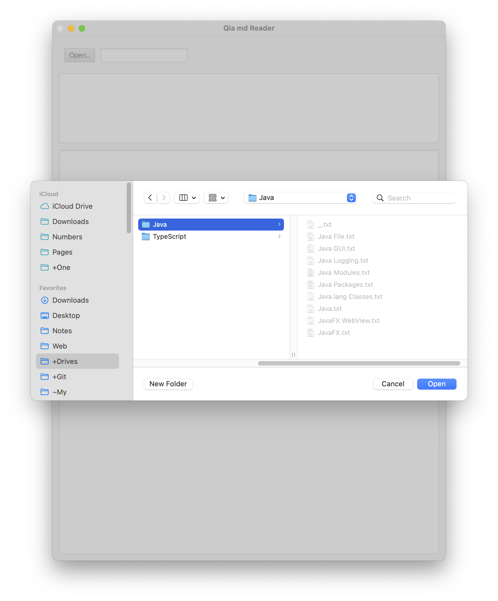
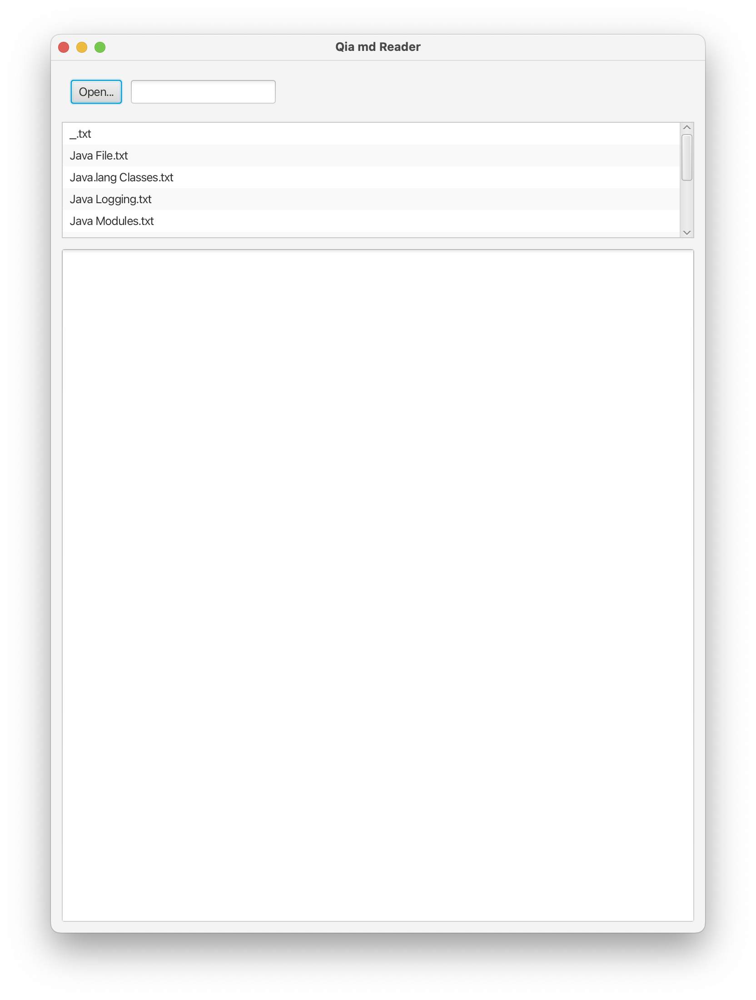
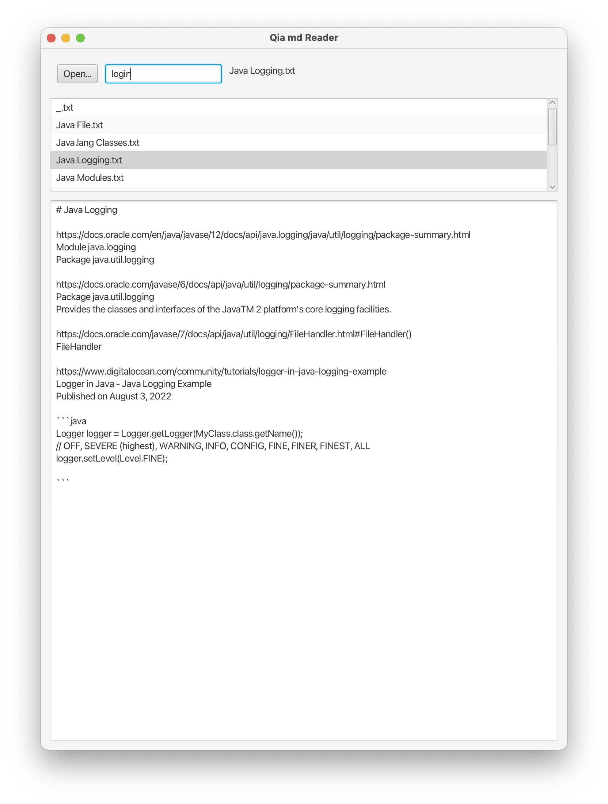
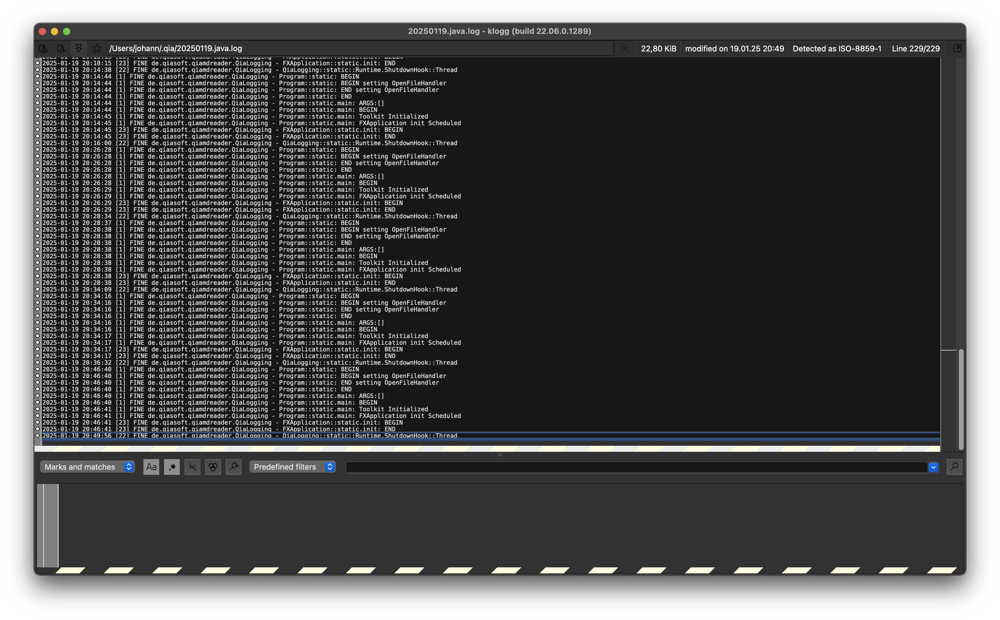
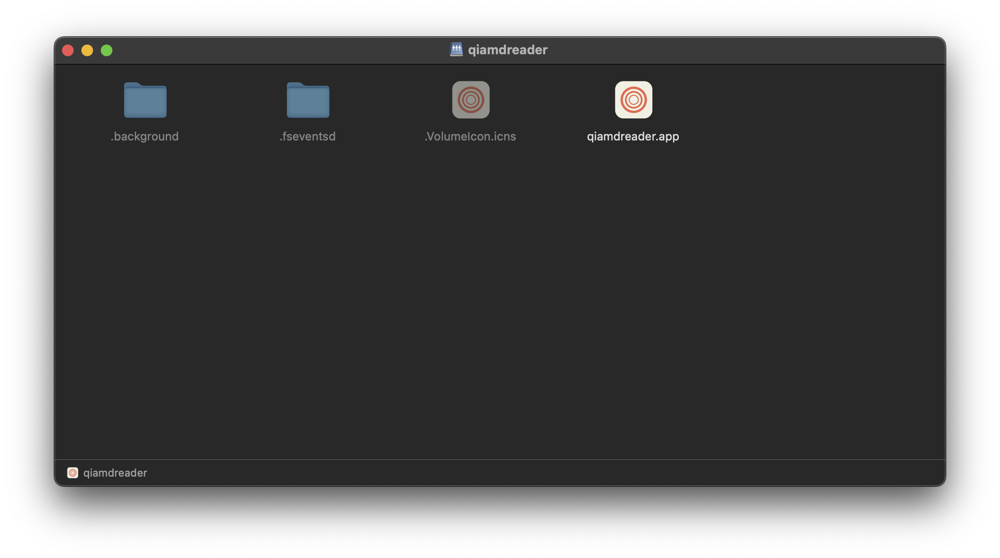
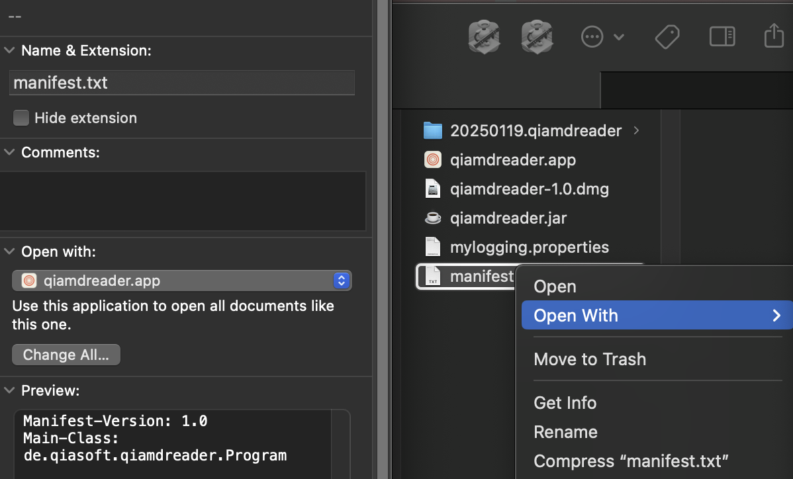

# Java-Apps.Qia-md-Reader

A very simple Java application to read text files in a chosen directory.

Why such an app?

As a ordinary digital information user, I want to

* Have an app which allows me to read (inspect) the content of a data file on disk when I come across the file
    * Not being force to reverse-think: to think of an app and then use the app to locate the file, finally I get the chance to read the file content.
* The file may be of a data type which require interpretation before its content can be comfortably understood
    * e.g., Markdown .md file, Audio .mp3 file, Video .mp4 file and so on

As a software developer, I want to

* Write once, run anywhere

## Preview

## Code-wise

### Program.java

The entry point (main) of the whole program, which is essentially an headless java.awt based application.

This is an attempt to have an extra layer in front of the GUI to make it easier to have one code base for Desktop, Mobile and the Web.

It is also told by many others on the Internet that AWT has better support for native OS events than JavaFX.

### FXApplication.java

The Desktop GUI implementation of the app.

JavaFX is chosen mainly for its support for WebView which would be an important part when Markdown is rendered as HTML. (Especially when considering the possible future support for Markdown and JSX .mdx files.)

### FileHelper.java

A helper class to make File IO related tasks in one logic.

### QiaLogging.java

During the implementation, a convinient Java logging Class QiaLogging is also created

## WIP

: May also be known as open issues

Make the macOS .app output work for "Open With" and of course the so-called "double-click".

## References

* https://github.com/eschmar/javafx-custom-file-ext-boilerplate
